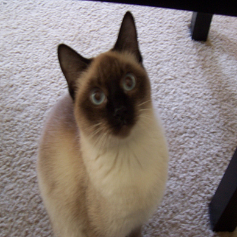

# U-Net for Semantic Segmentation with Oxford-IIIT Pet Dataset

This repository contains an implementation of the U-Net architecture for semantic segmentation using The Oxford-IIIT Pet Dataset. The U-Net model is a popular choice for image segmentation tasks, and this project demonstrates how to train and use the model from scratch.


## Table of Contents
- [About the Project](#about-the-project)
- [Dataset](#dataset)
- [Getting Started](#getting-started)
- [Results](#results)

## About the Project

Semantic segmentation is a computer vision task that involves classifying each pixel in an image to a specific class. The U-Net architecture is well-suited for this task and is widely used in medical image analysis, among other applications.

In this project, we provide a complete implementation of a U-Net model and demonstrate its usage on The Oxford-IIIT Pet Dataset. We encourage contributions and further experimentation with the model.

    


 
    


## Dataset

The [Oxford-IIIT Pet Dataset](https://www.robots.ox.ac.uk/~vgg/data/pets/) contains images of cats and dogs with pixel-level annotations. The dataset is useful for various computer vision tasks, including semantic segmentation.


## Getting Started

To get started with this project, follow these steps:

1. Clone the repository:

   ```bash
   git clone https://github.com/yourusername/unet-semantic-segmentation.git
   cd Semantic_Segmentation

2. create python Venv and install project requirements:

   ```bash
   pip install -r requirements.txt

## Results

You can download the pre-trained model from [this link](saved_model.pth).